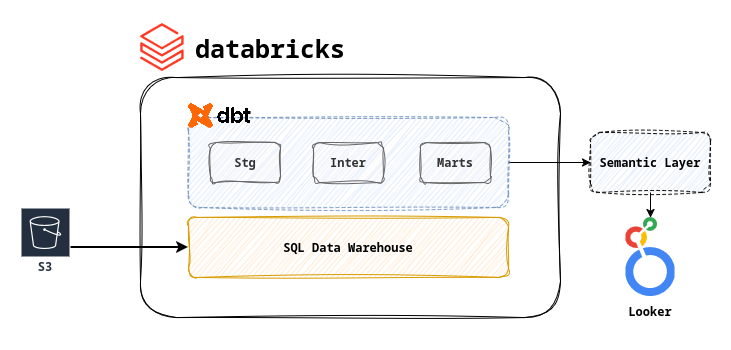
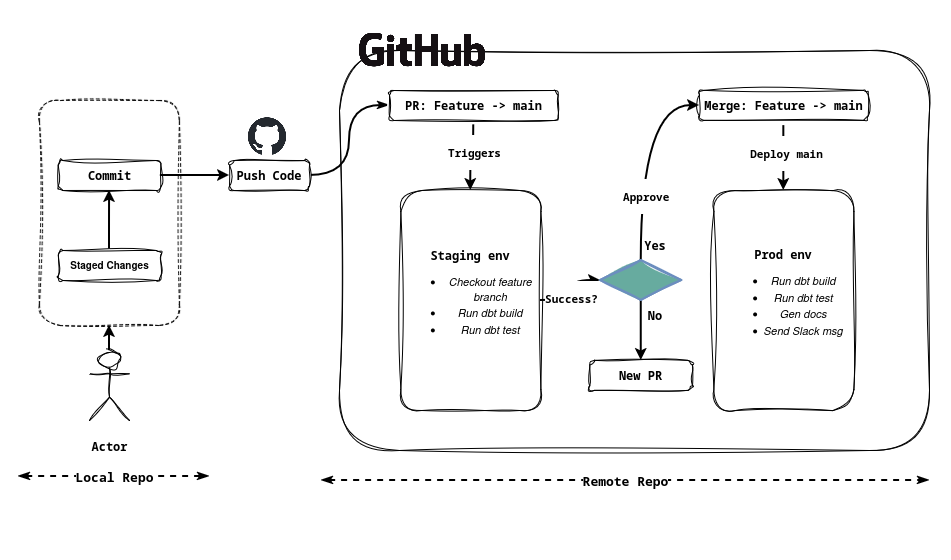

# Air Boltic Data Modeling

> **A robust data model proposal for Air Boltic analytics focusing on scalability and reliability.**

## Part 1: Data Model and design decisions

When designing the data model for Air Boltic I used the Kimball design technique as reference. Kimball focuses on the business process for which the data model is being designed. The business process in the case of Air Boltic can be separated into the following two categories:

**Operations:** This focuses on the air travel from point A -> point B. The destinations/ Regions Air Boltic serves the amount of flights that serve the regions, answering questions such as:

- What regions is Air Boltic serving?
- How is our aircraft fleet being utilized?

**Customer / Revenue:** This focuses on the customer behaviour patterns, growth and revenue generated from different routes, answering questions such as:

- Who are our customers?
- Revenue generated.
- What flights (short, long) perform best?

Considering that I was modeling for two different processes I decided on creating two fact tables. The first fact table **(fact_trips)** would answer all the questions from the Operational side of the business. The granularity selected for the *fact_trip* was the individual trips made (one row per trip).

The second fact table **(fact_orders)** would answer the question from the Customer / Revenue side of the business. The granularity selected for *fact_order* were the individual customer orders (one row per order).

The fact tables will be supplemented with dimension tables that enable more detailed filtering / slicing and diceing. The dimension table in the data model are, *dim_airplane* , *dim_airplane_model*, *dim_customer*, *dim_customer_group* and *dim_city*. The final data model takes shape with two fact tables at the center.

After designing the overall model I had to make a decision about data normalization and choose between Star or Snowflake schema. Since Air Boltic is a more recent venture of Bolt the clarity and understanding of the data and business is more important than saving compute cost by having less joins (Star Schema). Hence, I went and modeled the data in Snowflake Schema. This model serves as the base and we can create a semantic layer on top to meet the data needs of different teams by providing datasets and enabling self service analytics.

### Data Model Implementation

> [GitHub: Air Boltic Data Model](https://github.com/zem360/air-boltic-analytics)

I have created a small GitHub Repo to build out the data model. For the POC I have used dbt and duckdb. I have kept things simple here used a couple of python scripts to convert the provided data into CSV. I have then used the CSV's for dbt seed.

Ideally, I would have processed the data over 3 layers (Staging, Intermediate, Marts), but for simplicity sake I have kept just two layers: Staging and Marts. The staging layer reads from the seeds and adjusts column names using accepted standards. The actual model is implemented in the Marts layer.

In the Marts layer I enrich the fact tables with derived facts, add surrogate keys for table such as *dim_airplane_model* and create new dimension table such as *dim_city* to denormalize the data for simplicity.

Keeping scalability in mind I selected an incremental loading approach for the fact tables (fact_trips, fact_orders). The fact_orders table does not have an order_date which I assumed is a data sampling error, but for such tables an incremental approach is the way to go.

The dimension tables I took a full refresh approach as *dim_city* , *dim_airplanes* , *dim_airplane_model* , *dim_customers* and *dim_customer_group* have data that is appended rarely and can be loaded quickly with a full refresh approach. In addition to this, it used the dbt `.yml` file to add documentation to the Marts layer as well as some basic data tests for the layer.

Given more time I would add the missing Intermediate layer as well as more comprehensive data tests for each model. Also, I would implement dbt snapshots for the slowly changing dimensions in the dimension tables.

My current implementation uses dbt and duckdb to build out the solution a similar setup on the Bolt tech stack would look as follows:

I would use dbt on top of SQL Warehouse in databricks. A databrick workflow to ingest data from S3 into the Staging and then execute dbt to build models in the Intermediate and Marts layer. A final Semantic layer which transforms the models from the Marts and builds analytics ready datasets that would be used in Looker.

## Part 2: CI/CD Pipeline

My **Ideal Setup** would utilize GitHub Actions for CI/CD pipeline. The user would first develop and test on his local setup on a feature branch. I would set up a dev schema for each user isolated from the rest. The dbt `profiles.yml` can be used to set this up for each user. Once the user has tested the changes locally he can commit them and push to the remote repo and create a PR on GitHub.

The creation of the PR would trigger the `Staging Env` ; the feature branch would be checked out and the defined tests and build would be run. The idea is to make sure that the changes don't break downstream models. Once all the tests have passed a manual approval would be required to merge the feature branch to `main`.

Once the feature branch is merged to main the `Production Env` would be triggered. This would then deploy the changes to production and send out notifications on Slack / emails. I have visualized the setup below:

In **Real World** scenario I assume that GitHub exists, but Actions does not. In this case I would set up processes / flow to ensure smooth integration of changes. Firstly, I would encourage rigorous local testing in an isolated schema. On GitHub I would create a PR template with a check list about best practices to encourage well tested models.

For an automated CI/CD I would use `Cron`. I would use a small VM that pulls our repo on a schedule and then runs a bash script with that build and tests the model and then sends notification on success or failure. If successful, the user can merge the feature branch to main. This is more of a makeshift solution that assumes modern tooling does not exist.

Another solution that is more databricks focused would be to have to separate environments `staging` and `production` and use a simple databricks job that runs the dbt test and builds on the staging if successful then runs it on production. Running these jobs on schedule would help catch any error after the staging and would allow for user intervention.
